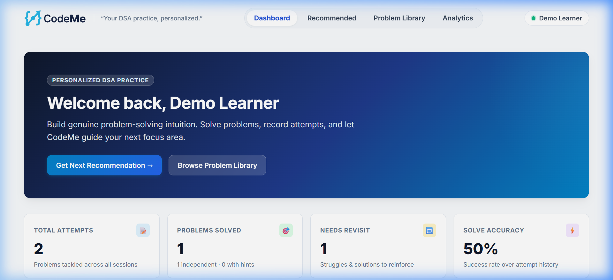
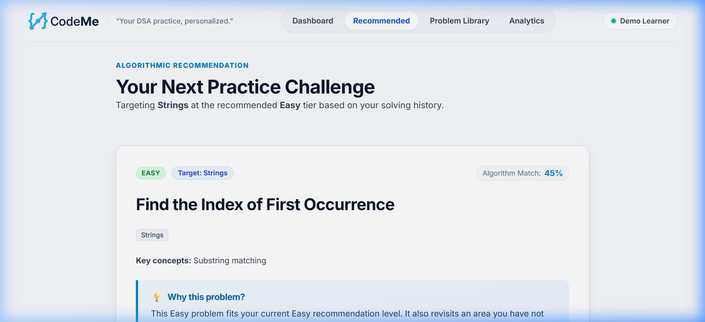
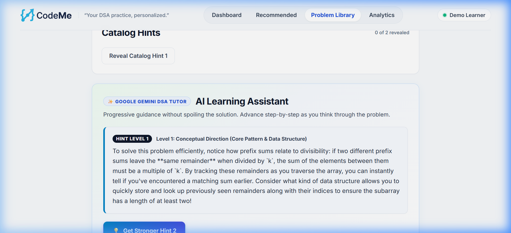
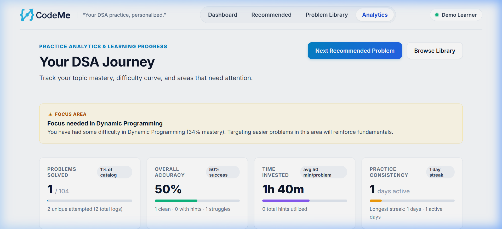

# CodeMe

> Your DSA practice, personalized.

**[🚀 Try CodeMe Live](https://codeme-phi.vercel.app/)**

CodeMe is a personalized DSA practice platform designed to guide learners through targeted algorithmic problem solving. It analyzes a learner's attempt history and topic weaknesses to recommend the most relevant next challenge, while providing a pedagogical AI Tutor powered by Google Gemini to offer progressive hints when learners get stuck.

---

## 📌 Project Snapshot

- **Challenge**: AI for Learning Hackathon
- **Team**: Team Erebus
- **Problems**: 104 curated DSA problems
- **Live Demo**: [https://codeme-phi.vercel.app/](https://codeme-phi.vercel.app/)
- **Repository**: [https://github.com/Ankith-Achar-27/codeme](https://github.com/Ankith-Achar-27/codeme)
- **Frontend**: React 19 + Vite
- **Backend**: Node.js + Express
- **Database**: MongoDB Atlas
- **AI Tutor**: Google Gemini (`gemini-3.6-flash`)
- **Deployment**: Vercel + Render

---

## 🎯 The Problem & Target Audience

### The Problem
CodeMe is designed to address three core challenges in traditional DSA preparation:
1. **Aimless Practice**: Learners often do not know what problem to practice next to systematically address their specific algorithmic weaknesses.
2. **The "Spoiler Trap"**: When stuck, traditional platforms often guide learners directly toward full code implementations or editorials, bypassing the critical intuition-building struggle.
3. **Difficulty Mismatch**: Inappropriate difficulty progression can cause frustration, burnout, or inefficient practice.

### Target Audience
- **CS Students & New Graduates**: Preparing for technical interviews and seeking a structured, high-yield practice roadmap.
- **Self-Taught Developers & Bootcamp Learners**: Seeking personalized guidance without paying for expensive private tutoring.
- **Software Engineers**: Brushing up on core algorithms efficiently with minimal time spent choosing what to solve next.

---

## 🔄 How CodeMe Works

CodeMe implements a focused, adaptive learning loop designed to guide deliberate practice:

1. **Practice a DSA Problem**: Select or receive a recommended problem from the 104-problem curated catalog.
2. **Record the Attempt**: Log your attempt outcome (Solved, Attempted, or Review Needed), time spent, and notes.
3. **Profile Updates**: CodeMe updates your topic mastery profile, difficulty progression, and recency data.
4. **Candidate Scoring**: The recommendation engine scores candidate problems across topic weakness, difficulty fit, failure relevance, concept overlap, and recency.
5. **Personalized Recommendation**: CodeMe serves the next challenge with an explainable rationale explaining why it was selected.
6. **Progressive AI Tutoring**: When stuck, the AI Tutor provides 3 tiers of pedagogical hints without dumping full solutions.
7. **Analytics & Reflection**: Inspect topic mastery, practice streaks, and weakness areas to track ongoing growth.

---

## 🌟 Key Features

### 1. 🎯 Personalized Recommendation Engine
- **Data-Driven Practice**: Evaluates topic weakness, difficulty fit, failure relevance, concept overlap, and practice recency to determine a personalized next challenge.
- **Explainable Guidance**: Every recommendation provides transparent, personalized rationale explaining *why* this problem was selected for your current skill progression.
- **Deterministic Scoring**: Delivers consistent, reproducible recommendations grounded directly in your attempt history.

### 2. ✦ AI Tutor (Google Gemini)
- **Pedagogical 3-Tier Progressive Hints**:
  - **Hint 1 · Concept**: Small conceptual nudge to inspire algorithmic thinking. Never dumps code or algorithms.
  - **Hint 2 · Strategy**: Directional algorithmic approach and high-level strategy.
  - **Hint 3 · Implementation**: Concrete structural guidance, data structures, and edge cases without providing full copy-paste solutions.
- **Quota-Optimized Architecture**: A single Gemini generation request returns all 3 progressive hints as structured JSON. Hints 2 and 3 are revealed locally in-memory with zero additional API requests.
- **Request Deduplication & 15s Cooldown**: Prevents double-clicks and accidental quota exhaustion with a subtle cooldown indicator.
- **Deep Solution Breakdown**: On-demand post-attempt algorithmic explanations detailing time/space complexity and core principles.
- **Math & Notation Pipeline**: Custom rendering protects LaTeX formulas, Big-O notation, and code snippets while keeping currency signs and symbols clean.

### 3. 📊 Analytics & Topic Mastery
- **Visual KPIs**: Track total problems solved, success rates, practice streaks, and time invested.
- **Granular Topic Breakdown**: Measures mastery across Arrays, Two Pointers, Trees, Graphs, Dynamic Programming, and more.
- **Weakness Detection**: Directly identifies topics needing reinforcement and factors them into upcoming recommendations.

### 4. 📚 Curated Problem Catalog
- **104 curated DSA problems** with problem-specific descriptions, input/output examples with explanations, constraints, topic tags, and static hints.
- Real-time search, difficulty filters, and topic chips.

---

## 📸 Screenshots

Visual walkthrough of CodeMe's core user flows captured directly from the live application:

### Dashboard

*Personalized progress overview and current practice recommendation.*

### Recommendation Engine

*Explainable recommendation with target topic tags, match score, and personalized rationale.*

### Problem Details & AI Tutor

*Full DSA problem view showing the pedagogical AI Learning Assistant with a successful Google Gemini Hint 1 response (captured during live verification).*

### Analytics & Topic Mastery

*Topic mastery breakdown, focus area alerts, performance trends, and practice consistency.*

---

## 🏗️ Architecture

```text
┌────────────────────────────────┐
│      Vercel (Frontend)         │
│     React 19 · Vite · SPA      │
└───────────────┬────────────────┘
                │ HTTPS / JSON API
                ▼
┌────────────────────────────────┐
│      Render (Backend API)      │
│     Node.js · Express API      │
└───────┬────────────────┬───────┘
        │                │
        ▼                ▼
┌──────────────┐   ┌───────────────────────────┐
│MongoDB Atlas │   │       Google Gemini       │
│ Problems &   │   │     gemini-3.6-flash      │
│ Practice Data│   │(Quota-Optimized AI Tutor) │
└──────────────┘   └───────────────────────────┘
```

The system separates concerns between a reactive client SPA, a stateless Express API, a managed MongoDB document store, and Google Gemini for on-demand tutoring.

### Live Deployment

- **Frontend**: [https://codeme-phi.vercel.app/](https://codeme-phi.vercel.app/) (Vercel)
- **Backend**: Hosted on Render
- **Database**: MongoDB Atlas
- **AI**: Google Gemini (`gemini-3.6-flash`)

---

## 📁 Project Structure

```text
codeme/
├── client/                     # React 19 + Vite Frontend
│   ├── src/
│   │   ├── components/         # AiMarkdown, UI components
│   │   ├── pages/              # Dashboard, Library, ProblemDetails, Recommendation, Analytics
│   │   ├── services/           # API client (singleton)
│   │   └── utils/              # Text formatters, math notation sanitizers
│   ├── test/                   # Frontend unit tests (Markdown & AI hint state machine)
│   └── package.json
├── server/                     # Node.js + Express Backend API
│   ├── src/
│   │   ├── config/             # DB and environment configuration
│   │   ├── controllers/        # AI, Problem, Attempt, Analytics, Recommendation controllers
│   │   ├── models/             # Mongoose schemas (Problem, Attempt, User)
│   │   ├── routes/             # REST API endpoints
│   │   ├── services/           # aiService (Gemini), recommendationService, analyticsService
│   │   └── utils/              # Seeding utilities
│   ├── test/                   # Backend tests (AI parser, recommendation, analytics)
│   └── package.json
└── README.md
```

---

## 🚀 Quick Start

### Prerequisites
- [Node.js](https://nodejs.org/) (v18 or later recommended)
- [MongoDB](https://www.mongodb.com/) (Local instance or MongoDB Atlas connection string)
- [Google AI Studio](https://aistudio.google.com/) (for Gemini API key)

### 1. Clone & Install Dependencies

```bash
# Clone the repository
git clone https://github.com/Ankith-Achar-27/codeme.git
cd codeme

# Install client dependencies
cd client
npm install

# Install server dependencies
cd ../server
npm install
```

### 2. Configure Environment Variables

#### Backend (`server/.env`)
Create `server/.env` (or copy from `server/.env.example`):

```env
PORT=5000
MONGODB_URI=mongodb://127.0.0.1:27017/codeme
CLIENT_URL=http://localhost:5173

# Google Gemini API
AI_API_KEY=your_gemini_api_key_here
AI_MODEL=gemini-3.6-flash
AI_PROVIDER=gemini
```

#### Frontend (`client/.env`)
Create `client/.env` (or copy from `client/.env.example`):

```env
VITE_API_URL=http://localhost:5000/api
```

### 3. Seed Problem Catalog

Seed the 104 curated DSA problems into your MongoDB database:

```bash
cd server
npm run seed
```

### 4. Run Development Servers

**Terminal 1 (Backend API):**
```bash
cd server
npm run dev
# Server runs on http://localhost:5000
# Health check: http://localhost:5000/api/health
```

**Terminal 2 (Frontend Client):**
```bash
cd client
npm run dev
# Vite runs on http://localhost:5173
```

---

## 🛡️ Evidence of Quality & Reliability

CodeMe is engineered with reliability, deterministic behavior, and resilience guarantees across both frontend and backend systems.

### Automated Testing
- **Backend Services (30/30 passing)**: Verifies deterministic recommendation scoring, failure recovery logic, topic mastery aggregations, strict Gemini JSON schema parsing, graceful API error handling, and catalog integrity:
  ```bash
  cd server
  npm test
  ```
- **Catalog Integrity (104/104 verified)**: Validates that all 104 problems contain problem-specific descriptions, input/output examples with explanations, constraints, difficulty classifications, topic tags, and static hints without missing schema fields.
- **Frontend State & Parsers (16/16 passing)**: Verifies LaTeX and math notation sanitization, bold/code token protection, single-request hint progression, local state transitions, double-click deduplication, and cooldown timer enforcement:
  ```bash
  cd client
  node --test test/*.test.js
  npm run lint
  npm run build
  ```
- **Code Quality**: Zero lint warnings or errors under Oxlint and successful production builds.

### Error States & Resilience
- **Zero-Extra-API Hint Progression**: A single Gemini generation request returns all 3 progressive hints at once. Tiers 2 and 3 are revealed instantly in-memory, reducing latency, API requests, and quota consumption.
- **Debounce & 15-Second Cooldown**: Prevents rapid multi-clicking and protects free-tier API quotas with visual cooldown timers and disabled button states.
- **Graceful Degradation**: If the Gemini API is unreachable or returns a 502/503 status, CodeMe catches the exception gracefully, informs the learner clearly, and seamlessly provides curated static problem hints so practice is never interrupted.
- **Notation & Math Protection**: Custom sanitization prevents raw LaTeX or Big-O notation (`O(N log N)`) from breaking markdown parsers or producing formatting artifacts.

### Security
- **Credential Protection**: No secrets or API keys are committed to source control. Environment files are excluded through `.gitignore`, with clean `.env.example` templates provided.
- **Backend Isolation**: Gemini API keys reside exclusively on the Render backend service; the client SPA has zero access to private provider tokens.
- **CORS Restriction**: Strict CORS middleware configured to accept requests only from the verified client origin.
- **Input Sanitization**: Problem and attempt IDs are validated against MongoDB ObjectId patterns before querying to prevent query injection.

### Accessibility & UX
- High-contrast dark-mode interface designed for readable text and clear visual hierarchy.
- Fully responsive layout adapting across mobile, tablet, and desktop viewports.
- Clear visual focus states, micro-animations, and accessible loading states across all asynchronous interactions.

---

## ⚠️ Known Limitations

- **External Code Execution**: CodeMe currently focuses on algorithmic problem solving, recommendation, and AI tutoring. Learners execute their code in their preferred local editor or runtime, logging their attempt outcome. In-browser sandboxed execution is prioritized on the upcoming roadmap.
- **Single-Learner Session**: The hackathon build uses a dedicated demo learner profile rather than multi-user authentication, keeping evaluation friction-free.
- **Catalog Scope**: The catalog is currently curated to 104 high-frequency DSA problems spanning core patterns (Two Pointers, Sliding Window, Trees, Graphs, DP, etc.).

---

## 🗺️ Product Roadmap

- [ ] **In-Browser Monaco Code Editor**: Embedded editor with Web Worker / WebAssembly execution for instant in-browser test running in JavaScript, Python, and C++.
- [ ] **Multi-Tenant Authentication**: Sign in with GitHub or Google with cloud sync across devices.
- [ ] **Spaced Repetition Review System**: SuperMemo (SM-2) scheduling to periodically resurface previously failed or fragile problems at optimal retention intervals.
- [ ] **Mock Interview Simulator**: Real-time timed interview mode with simulated interviewer follow-up questions powered by Gemini.
- [ ] **Community & Leaderboards**: Track practice streaks and peer problem-solving progress.

---

## 🤖 AI Use Declaration

AI tools were used during the development of CodeMe to assist with implementation, debugging, documentation, UI refinement, testing, and development guidance.

### Tools Used

- **ChatGPT** — Used for architecture planning, technical reasoning, debugging guidance, feature planning, code review, and documentation support.
- **Antigravity** — Used as a coding agent to implement and refine frontend/backend features, tests, UI changes, and deployment-related configuration.
- **Gemini** — Integrated into CodeMe as the AI Tutor for progressive DSA hints and solution/concept explanations.

### Verification

AI-assisted code and suggestions were reviewed and tested by the team. We personally verified core application flows including problem browsing, problem details, attempt recording, personalized recommendations, analytics, AI Tutor behavior, database persistence, deployment connectivity, error handling, and production builds.

Automated validation included backend tests, frontend linting, production builds, and validation of the complete 104-problem catalog.

---

## 🛠️ Tech Stack

- **Frontend**: React 19, Vite, Vanilla CSS Design System, Oxlint
- **Backend**: Node.js, Express, Mongoose, Native Node Test Runner
- **Database**: MongoDB / MongoDB Atlas
- **AI Engine**: Google Gemini API (`gemini-3.6-flash`)
- **Hosting**: Vercel (Frontend), Render (Backend API), MongoDB Atlas (Database)

---

## 👥 Team

Built with ❤️ by **Team Erebus** for the **AI for Learning Hackathon**.
